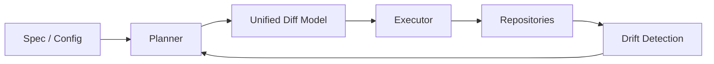
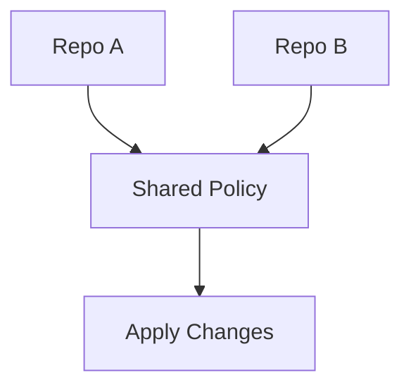

# Repora / repoctl

> Deterministic, policy-driven repository management — treat repos as declarative state.

---


---

## Overview

**Repora** is a repository control plane that defines and enforces the desired state of codebases at scale.

**repoctl** is the CLI that reconciles real repositories to that state.

Think:

- GitOps → but for repositories themselves
- Terraform → but for repo structure, policy, and CI/CD
- Policy engine → for developer workflows and governance

---

## Core Model

Repora treats repositories as **declarative resources**:



### Key properties

- **Deterministic** — same spec → same result
- **Idempotent** — safe to re-run
- **Convergent** — drives toward desired state
- **Auditable** — diff-first execution model

---

## Features

### Repository orchestration

- Multi-repo reconciliation
- Bulk operations with concurrency controls
- Dependency-aware execution

### Policy & governance

- Enforced structure for files, directories, and configs
- CI/CD standardization
- Security baselines

### Drift management

- Continuous drift detection
- Unified diff model
- Controlled remediation

### Templating & generation

* README templating
* CI/CD pipelines
* Repo bootstrapping

### Deterministic document routing

* Context-aware route selection
* Token-budget enforcement
* Canonical document preference
* Prompt and policy isolation
* Deterministic retrieval pruning

### Extensibility planned

* Container registries
* Model and workflow definitions
* Plugin system

---

## Development

This project uses [mise](https://mise.jdx.sh/) to manage development tools and tasks.

### Setup

```bash
mise install
```

### Common Tasks

* **Format code:** `mise run fmt`
* **Lint code:** `mise run lint`
* **Run tests:** `mise run test`
* **Build:** `mise run build`

---

## Example


### Spec

```yaml
repos:
  - name: service-a
    template: base-service
    policies:
      - ci-standard
      - security-baseline
```

### Apply

```bash
repoctl apply -f repora.yaml
```

### Output conceptual

```diff
+ .github/workflows/ci.yml
+ README.md
~ package.json (scripts normalized)
- legacy-config.yml
```

---

## CLI

```bash
repoctl init
repoctl plan
repoctl apply
repoctl diff
repoctl drift
```

### Design notes

- `plan` computes desired changes
- `apply` executes with safeguards
- `diff` produces explicit, reviewable changes
- `drift` detects divergence over time

---

## Document Routing

Repora includes a deterministic document routing model intended to reduce context size and retrieval noise for AI-assisted workflows.

Routing operates before retrieval expansion.


Core principles:

- route before retrieval
- bounded context budgets
- canonical document preference
- deterministic pruning
- explicit prompt boundaries

Artifacts:

- `.repora/document-router.yaml`
- `schemas/document-router.schema.json`
- `docs/routing/document-routing.md`
- `prompts/document-routing-overlay.md`

The goal is to prevent repository-wide ingestion for narrow tasks.

---

## Architecture

### Layers

- **Spec Layer** — declarative config using YAML or a future DSL
- **Planner** — builds the execution graph
- **Diff Engine** — produces the unified diff model
- **Executor** — applies changes with bounded concurrency
- **Adapters** — integrate with Git providers, CI systems, registries, and workflow engines

---

## Concurrency Model

Repora is designed for controlled parallelism across many repositories.



Execution should be:

- Graph-aware
- Bounded by explicit concurrency limits
- Safe for retries
- Ordered when dependencies require it

---

## Security Model

Repora assumes repository mutation is a privileged operation.

Core security principles:

- Principle of least privilege
- Authentication delegated to system Git in v0.1
- Explicit mutation boundaries
- No implicit side effects
- Reviewable plans before mutation
- No credentials stored in `repora.yaml`

### Threat considerations

- Supply-chain injection via templates
- Unauthorized repository mutation
- Drift masking malicious changes
- Over-broad Git credential permissions
- Unsafe plugin execution
- Prompt injection through repository documents
- Context poisoning via archived or generated artifacts

### Planned mitigations

- Signed templates
- Policy attestations
- Audit logs
- Explicit diff approval workflows
- Sandboxed plugin execution
- Deterministic routing allowlists
- Canonical document precedence

---

## License

This project is licensed under the **Business Source License 1.1 (BSL)**.

- Free for personal and internal use
- Commercial or SaaS use requires a license
- Converts to Apache-2.0 on 2029-01-01

See [LICENSE](./LICENSE) for details.

---

## Roadmap

- [ ] Formal spec schema
- [ ] Stable unified diff model
- [ ] README templating
- [ ] CI/CD control
- [ ] Policy packs
- [ ] Plugin system
- [ ] Container registry integrations
- [ ] Model and workflow definitions
- [ ] Hosted or self-hosted control plane
- [ ] AST-aware routing
- [ ] Graph-aware retrieval planning
- [ ] Trust-scored document classes

---

## Philosophy

Repora is built around a few principles:

- **State over scripts**
- **Diff before mutation**
- **Policy as code**
- **Reproducibility over convenience**
- **Controlled mutation over implicit automation**

---

## Comparison

| Tool           | Focus                    | Gap                                             |
| -------------- | ------------------------ | ----------------------------------------------- |
| Terraform      | Infrastructure state     | No repo-level control                           |
| GitHub Actions | CI/CD execution          | No global repo governance                       |
| Backstage      | Service catalog          | Catalog-first, not enforcement-first            |
| Repo templates | Bootstrapping            | Weak long-term drift control                    |
| Repora         | Repository control plane | Purpose-built for repo state, policy, and drift |

---

## Status

Early-stage and actively evolving.

Expect:

- Breaking changes
- Spec iteration
- Architecture refinement
- Security model hardening

---

## Contributing

Currently closed to external contributions while the core model stabilizes.

For now:

- Open an issue for discussion
- Propose use cases
- Share failure modes from real repository management workflows

---

## Contact

Micrantha Software
[https://micrantha.com](https://micrantha.com)

---

## Final Note

Repora is an attempt to make repository management deterministic, enforceable, and scalable.

The goal is not just to automate repository changes, but to make those changes planned, reviewable, repeatable, and governed.
