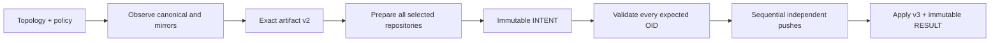

# Repora / repoctl

> Experimental, deterministic repository control with explicit review and evidence boundaries.


## Overview

**Repora** manages repository state through explicit topology, observation, policy, exact planning, stale-safe execution, honest partial results, and durable evidence.

**repoctl** is the current Go CLI. Its primary runtime is a local-first Git mirror controller: each repository has one GitLab canonical and one or more GitHub, GitLab, or Bitbucket Cloud mirrors. Repora also has a separate bounded managed-README plan/apply domain, local repository-assessment commands, deterministic document-routing contracts, repository/CI, documentation, hooks/local-workflow, bounded commit-history, and mirror posture collectors, plus an offline convergence and posture-policy/reporting path.

Repora remains pre-alpha. The broader repository-control-plane model is product direction, not a claim that provider provisioning, hosted orchestration, automatic posture remediation, or arbitrary repository mutation exists today.

## Name

**Repora** is a coined name combining **repo**—the common shorthand for a source-code repository—with the botanical cadence of **flora**. It reflects the project’s role in managing a collection or ecosystem of repositories while fitting the broader Micrantha naming family.

## Why Go

Go was chosen for `repoctl` because it fits the operational shape of a repository-control CLI:

- it produces small, self-contained binaries that are straightforward to distribute across Linux, macOS, Windows, CI runners, and administrative hosts;
- fast startup and modest runtime overhead suit commands that inspect many repositories and frequently invoke system Git;
- the standard library provides strong support for subprocess control, cancellation, timeouts, filesystem work, structured encoding, and bounded concurrency without requiring a large dependency graph;
- static typing, explicit error handling, built-in testing, formatting, vetting, and race detection support deterministic behavior and long-term maintenance;
- cross-compilation and reproducible release automation keep the packaging and deployment boundary simple.

The choice is pragmatic rather than ideological. Repora delegates Git protocol and credential behavior to the installed Git executable instead of reimplementing Git, while Go owns topology, policy, planning, validation, execution, and evidence contracts. Languages such as Rust could provide stronger compile-time guarantees for some internal states, but Go currently offers the better trade-off for implementation speed, operational simplicity, contributor accessibility, and the project's expected performance envelope.

## Implemented today

### Mirror controller

- strict YAML validation and durable `uid` identity;
- provider-relative canonical and mirror topology;
- one or more GitHub, GitLab, or Bitbucket Cloud mirrors with stable `provider:path` identity;
- bounded single-mirror legacy URL compatibility;
- runtime HTTPS resolution and system Git authentication;
- independent per-mirror `EQUAL`, `BEHIND`, `AHEAD`, `DIVERGED`, and `ERROR` status;
- closed ref-policy v1: default branch only and explicit destructive authorization;
- exact reconciliation artifact v2 across every required mirror action;
- complete topology, policy, branch, and expected-OID preflight before action zero;
- sequential independent mirror execution with continuation after runtime failure;
- normal pushes and reviewed force-with-lease overwrites;
- apply v3 per-target before/desired/after/outcome evidence;
- execution-record v3 immutable intent/result evidence;
- bounded repository concurrency;
- historical artifact v1, apply v2, and execution-record v1/v2 compatibility.

### Managed README artifacts

- explicit per-repository `artifacts.readme` opt-in;
- contained local templates with deterministic, non-executable token replacement;
- exact `repora.io/managed-artifact-plan` v1 review artifacts;
- byte-aware README diffs and exact stale-state preflight;
- dry-run using the same reviewed plan;
- isolated candidate commit construction without mutating a user checkout;
- exact reviewed-base leased canonical push with no force override;
- `repora.io/managed-artifact-execution-record` v1 INTENT/RESULT evidence;
- explicit partial-success behavior across multiple repositories;
- fresh mirror reconciliation as a separate `status → plan → apply` cycle after canonical README mutation.

See [`examples/managed-readme/`](examples/managed-readme/) for a complete configuration/template example.

### Assessment and routing foundations

- strict `repora.repository-assessment` v1 validation;
- bounded assessment skeleton creation without overwrite;
- deterministic finding and scorecard projections;
- evidence-backed assessment contracts and templates;
- deterministic document-routing manifests, trust tiers, context receipts, hierarchical summaries, and bounded Go AST source selectors.

### Read-only GitHub posture inventory

- versioned `repora.posture-inventory` v1 normalized fact contract;
- explicit observed, unknown, and unavailable evidence states so observed `false` is not confused with missing permission or incomplete evidence;
- default-branch and branch-protection observation including status checks, required reviews, force-push protection, and deletion protection where accessible;
- Git-tree-backed `CODEOWNERS`, `SECURITY.md`, license, issue/PR template, dependency-automation, and workflow-path facts;
- GitHub Actions normalization for workflow/job permissions, `pull_request_target`, runner labels, literal `self-hosted` label evidence, action references, and pinning style;
- GET-only provider capability boundary with optional `GITHUB_TOKEN` / `GH_TOKEN` read from the environment;
- permission-hidden provider data retained as unavailable evidence rather than false negatives;
- no policy evaluation, findings, scanner execution, or provider mutation in inventory.

See [GitHub posture inventory v1](docs/posture-inventory.md).

### Documentation and README posture

- versioned `repora.posture-documentation` v1 evidence contract using the same observed/unknown/unavailable fact model;
- `repoctl posture docs OWNER/REPO` GET-only collection from immutable default-branch tree/blob evidence;
- optional repository-declared `.repora/posture-documentation.yaml` profile for deterministic document, README section/link, and exact content-marker observation;
- conservative built-in baseline that observes only root `README.md` when a repository profile is known absent;
- truncated-tree and inaccessible-blob evidence remains unknown/unavailable instead of becoming false negatives;
- document-router trust metadata is reused so canonical, generated, archived, experimental, implementation, and external documents retain their declared authority class;
- exact content markers support bounded stale-metadata observation without semantic or LLM judgment;
- profile configuration selects facts to observe but does not assign severity, suppress policy, create findings, or grant remediation authority.

See [Documentation posture v1](docs/posture-documentation.md).

### Hooks and local-workflow posture

- versioned `repora.posture-hooks` v1 fact contract using the shared observed/unknown/unavailable evidence model;
- `repoctl posture hooks OWNER/REPO` GET-only collection from default-branch tree/blob evidence;
- common manager/config detection for pre-commit, Lefthook, Husky, and custom `.githooks` entrypoints;
- optional bounded `.repora/posture-hooks.yaml` profile for manager, hook paths, required local checks, bootstrap docs, and bypass docs;
- required-check comparison against observable GitHub Actions workflow text while keeping CI authoritative;
- bounded static network-load signals for hook/config text without following or executing referenced code;
- missing paths become observed `false` only when tree evidence is complete; inaccessible/truncated evidence remains unavailable/unknown;
- hook presence is not treated as trust, and target-repository hooks or package-manager commands are never installed or executed;
- executable state remains explicit `unknown` in v1 because the shared GitHub tree model does not yet expose file mode.

See [Hooks/local-workflow posture v1](docs/posture-hooks.md).

### Bounded commit-history posture

- versioned `repora.posture-commits` v1 evidence contract;
- `repoctl posture commits OWNER/REPO` GET-only collection over an explicitly bounded default-branch history window;
- signature verification state, merge shape, change size/file scope, configured sensitive-path matches, and optional commit-to-PR association facts;
- direct-push, missing-review, tag-signature, and release-boundary conclusions remain unknown when current evidence cannot prove them;
- author/committer identity analytics, productivity scoring, blame, and inferred intent are excluded.

### Mirror posture

- versioned `repora.posture-mirrors` v1 fact contract derived from normal `repora.yaml` topology;
- explicit canonical and mirror `provider:path` identities, mode, and `canonical_to_mirror` direction;
- default-branch names and default-branch-name drift where evidence is available;
- existing `EQUAL`, `BEHIND`, `AHEAD`, and `DIVERGED` reconciliation state plus ahead/behind counts—no second drift algorithm;
- GitHub repository visibility and authenticated/current-actor push permission when returned by the GET-only provider API;
- GitLab provider-administration metadata represented as unavailable until an adapter exists;
- tag and release drift represented explicitly as unknown under the current default-branch-only ref scope;
- local mirror-cache refresh may occur for observation, but posture does not push, synchronize mirrors, publish releases, or mutate provider settings.

See [Mirror posture v1](docs/posture-mirrors.md).

### Offline posture convergence, policy, and reporting

- `repoctl posture converge` strictly consumes captured versioned collector artifacts and emits `repora.posture-policy-inputs` v1 JSON;
- malformed/unsupported artifacts, duplicate sources, ambiguous mirror identity, and cross-repository fact mixing fail atomically;
- convergence preserves observed/unknown/unavailable state and evidence without provider re-scan;
- `repoctl posture report` consumes normalized facts plus an external `repora.posture-policy-profile` v1;
- evaluation uses explicit severity, remediation, exceptions, and required `--as-of YYYY-MM-DD` input;
- Markdown and JSON reports are deterministic for the same captured artifacts, policy, and `as-of` date;
- the offline policy/report layer has no provider access, scanner execution, remediation, or mutation authority.

See [Posture policy and deterministic reports](docs/posture-policy.md).

### Build, release, and assurance

- `v0.1.0` established the first published archive baseline with Linux amd64, macOS amd64/arm64, and Windows amd64 archives plus SHA-256 checksums;
- standalone Nix package/app/check/dev-shell/formatter outputs for Linux x86_64 and macOS x86_64/aarch64;
- explicit fast/unit, integration, contract, CLI end-to-end, and cross-platform build gates;
- Go vet + Staticcheck, vulnerability scanning, CodeQL, Git-history secret detection, dependency-license validation, and workflow-policy validation.

## Current limitations

- GitLab canonical repositories only;
- built-in GitHub, GitLab, and Bitbucket Cloud HTTPS transport bases only;
- default branch only;
- mirrors execute sequentially inside one repository;
- no tags, wildcard refs, deleted-ref reconciliation, or complete ref inventory;
- no provider provisioning;
- no cross-remote transaction or automatic rollback;
- no runtime Anthesis policy evaluator, transport, authentication, or approval workflow;
- managed artifacts support root `README.md` only;
- posture provider APIs are GitHub-first; GitLab/Bitbucket provider-administration posture adapters and automatic posture remediation are not implemented;
- mirror posture does not yet observe tag/release drift and does not perform synchronization;
- documentation posture is deterministic/file-backed only; it does not perform prose linting, semantic review, LLM analysis, or automatic rewrites;
- hooks posture uses static bounded text evidence only and does not execute hooks or prove semantic equivalence between local checks and CI;
- routing and assessments do not automatically mutate repositories or provider settings;
- no release signing or full provenance attestation.

## Installation

### Release archives

GitHub Releases publish versioned archives for Linux amd64, macOS amd64/arm64, and Windows amd64. Each release includes `checksums.txt`; packaged binaries report the embedded tag and source commit through `repoctl --version`. `v0.1.0` established the first released baseline; the tagged changelog and GitHub Release define the supported surface for each later version.

See [release installation and verification](docs/release.md) for target support, checksum commands, local reproduction, and rollback guidance.

### Nix

The repository also exposes a standalone flake:

```bash
nix build .#repora
nix run . -- --help
nix flake check --print-build-logs
```

See [standalone Nix packaging](docs/nix.md). Nix packaging exposes Repora capability; it does not grant repository mutation authority.

## Mirror execution model



Mirror identity is provider/path. Configuration order determines deterministic review and execution order but is not identity. Runtime aliases are local details and cannot retarget imported intent.

After complete preflight, one mirror failure does not prevent later independent mirrors. A valid result may be `APPLIED, FAILED, APPLIED`. Successful earlier mirrors are not rolled back. The command returns nonzero and retry requires a fresh observation and new artifact.

## Configuration

```yaml
repos:
  - id: anthesis
    uid: repo.anthesis
    canonical:
      provider: gitlab
      path: micrantha/anthesis
    mirrors:
      - provider: github
        path: hackelia-micrantha/anthesis
    mode: mirror
    policy:
      refs:
        version: 1
        scope: default-branch-only
        destructive: require-force
    artifacts:
      readme:
        template: templates/README.md.tmpl
        values:
          title: Anthesis
```

Credentials must not be embedded in configuration. Authentication is delegated to system Git and credential helpers. Managed README templates are local configuration-root-relative files and cannot execute code or fetch remote content. Posture provider tokens are optional environment inputs and are never stored in `repora.yaml`.

Repora stores bare repository caches under `$HOME/.cache/repora` by default. Containers, sandboxes, and other environments with a read-only home may set `REPORA_CACHE_DIR` to an absolute writable directory. The override is runtime-only, is not serialized into plans or evidence, and does not weaken the existing safe-UID, symlink, or cache-integrity checks.

Documentation posture targets are independently declared in `.repora/posture-documentation.yaml`; hooks/local-workflow posture expectations are independently declared in `.repora/posture-hooks.yaml`. These repository-owned profiles are observation configuration, not policy or mutation authority.

See [`docs/configuration/provider-path-topology-v1.md`](docs/configuration/provider-path-topology-v1.md) and [`examples/managed-readme/`](examples/managed-readme/).

## CLI

### Mirror reconciliation

```bash
repoctl --version
repoctl status -f repora.yaml
repoctl status -f repora.yaml --json

repoctl plan -f repora.yaml
repoctl plan -f repora.yaml --artifact > plan.json

repoctl apply -f repora.yaml --dry-run
repoctl apply -f repora.yaml --plan-file plan.json --dry-run --json
repoctl apply -f repora.yaml --plan-file plan.json
repoctl apply -f repora.yaml --plan-file plan.json --force --json
```

`sync` is an alias for `apply`. Single-mirror-only selections retain `repora.apply` v2; mixed or multi-mirror selections use `repora.apply` v3.

Mirror-command exit codes:

- `0`: success;
- `1`: operational failure, stale preflight, journal failure, or partial success;
- `2`: complete destructive intent requires `--force`.

### Managed README

```bash
repoctl plan-readme -f repora.yaml
repoctl plan-readme -f repora.yaml --artifact > readme-plan.json

repoctl apply-readme -f repora.yaml --plan-file readme-plan.json --dry-run
repoctl apply-readme -f repora.yaml --plan-file readme-plan.json
repoctl apply-readme -f repora.yaml --plan-file readme-plan.json --json
```

Managed README apply does not accept `--force`. Stale exact plans exit `2`; invalid plans and operational failures exit `1`.

### Posture collection, convergence, and reporting

```bash
repoctl posture inventory OWNER/REPO > posture.json
repoctl posture docs OWNER/REPO > documentation-posture.json
repoctl posture hooks OWNER/REPO > hooks-posture.json
repoctl posture commits OWNER/REPO > commit-posture.json
repoctl posture mirrors -f repora.yaml > mirror-posture.json

repoctl posture converge \
  --inventory posture.json \
  --docs documentation-posture.json \
  --hooks hooks-posture.json \
  --commits commit-posture.json \
  --mirrors mirror-posture.json \
  --repo-uid repo.example \
  > posture-facts.json

repoctl posture report \
  --profile policy.json \
  --facts posture-facts.json \
  --as-of 2026-08-24 \
  --format markdown
```

`posture inventory`, `posture docs`, `posture hooks`, and `posture commits` use GET-only GitHub provider reads. Public repositories need no token; private or protected provider evidence may use `GITHUB_TOKEN` or `GH_TOKEN`.

`posture hooks` never installs or executes target-repository hooks. CI remains the enforcement authority.

`posture mirrors` loads the normal Repora topology, refreshes local mirror-cache observation using existing status semantics, and may also use GET-only GitHub metadata reads. It emits facts, not findings, and does not push or synchronize repositories.

`posture converge` and `posture report` are offline-only. They do not contact providers, rescan repositories, execute scanners, or mutate repository/provider state.

### Assessments

```bash
repoctl validate-report report.json
repoctl list-findings report.json
repoctl generate-scorecard report.json
repoctl assess new-report.json
```

These commands operate on local assessment artifacts and do not perform Git or provider mutation.

## Contracts and architecture

- [Current architecture](docs/architecture/current-system.md)
- [Managed artifact architecture](docs/architecture/managed-artifacts.md)
- [Managed README planning/apply lifecycle](docs/architecture/managed-artifact-planning.md)
- [GitHub posture inventory v1](docs/posture-inventory.md)
- [Documentation posture v1](docs/posture-documentation.md)
- [Hooks/local-workflow posture v1](docs/posture-hooks.md)
- [Mirror posture v1](docs/posture-mirrors.md)
- [Posture policy and deterministic reports](docs/posture-policy.md)
- [Repository/CI posture model](docs/posture.md)
- [Failure and recovery semantics](docs/architecture/failure-semantics.md)
- [Exact reconciliation artifact](docs/architecture/reconciliation-plan-artifact.md)
- [Execution journal](docs/architecture/execution-journal.md)
- [Repository assessments](docs/assessments.md)
- [Document routing](docs/routing/document-routing.md)
- [Standalone Nix packaging](docs/nix.md)
- [Release installation and verification](docs/release.md)
- [Security CI and finding triage](docs/security-ci.md)
- [Security policy](SECURITY.md)
- [Changelog](CHANGELOG.md)
- [Architecture decisions](docs/decisions/README.md)
- [Active implementation plan](docs/plans/current.md)
- [Versioned schemas](schemas/)

## Development

```bash
mise install
mise run fmt
mise run lint
mise run test
mise run build
```

Direct Go tooling and the standalone Nix development shell are also supported. CI reuses the repository's canonical validation boundaries rather than maintaining a separate Nix-only policy.

## Security model

Current controls include:

- credentials delegated to system Git;
- credential-bearing HTTP URLs rejected;
- durable identity separated from transport and runtime aliases;
- closed default-branch-only ref policy;
- reviewed destructive intent plus explicit command authorization;
- complete all-target stale-ref preflight;
- force-with-lease for every forced mirror action;
- fail-closed intent persistence;
- path-bound per-target result evidence;
- managed README fixed-path authority, contained local templates, exact-plan preflight, and exact-base leased pushes;
- repository/CI, documentation, hooks, and commit posture provider reads are GET-only, with environment-only optional tokens and explicit unavailable evidence;
- mirror posture reuses fetch-only local cache observation and GET-only provider metadata reads, with no push/synchronization/provider-mutation path;
- posture convergence/reporting is offline-only and preserves evidence gaps without provider or mutation authority;
- documentation and hooks profiles/configuration are treated as bounded data and are never executed; profile configuration cannot grant severity, remediation, or mutation authority;
- target-repository hook code is never installed, sourced, or executed by posture collection;
- sanitized diagnostics and safe relative journal references;
- no implicit target selection, replay, rollback, cross-remote atomicity, provider mutation, or approval claim;
- tag-only release publication with least-privilege workflow permissions;
- reachable-vulnerability, CodeQL, secret, dependency-license, static-analysis, test-pyramid, and workflow-policy gates.

ADR-0018 defines an optional future Anthesis `pre_apply` authorization seam. Runtime authorization-policy integration remains disabled/deferred and cannot currently alter Repora execution.

## Roadmap

The `v0.1.0` mirror-controller release is published and independently verified. The `v0.2.0` release candidate adds managed README mutation, routing and assessment foundations, standalone Nix packaging, GitHub repository/CI, documentation, hooks, bounded commit-history, and mirror posture, offline posture convergence/policy/reporting, and Bitbucket Cloud mirror transport.

Project-truth reconciliation (#139) and representative operator acceptance (#137) are complete. Publication of the next pre-alpha capability baseline (#138) is the active release gate. Provider mutation, Anthesis runtime coupling, expanded ref scope, concurrent mirror mutation, signing, full provenance, and hosted control-plane behavior remain explicitly deferred.

The authoritative order is maintained in [`docs/plans/current.md`](docs/plans/current.md) and GitHub issues.

## License

Business Source License 1.1:

- free for personal and internal use;
- commercial or SaaS use requires a license;
- converts to Apache-2.0 on 2029-01-01.

See [LICENSE](LICENSE).

## Project status

Pre-alpha and actively evolving. Tagged releases define supported release scope; current `main` may contain additional unreleased work. The changelog and versioned contracts remain the compatibility authority until a later stability milestone.

External contributions are currently closed while the core model stabilizes. Concrete use cases and failure reports are welcome.

Micrantha Software — [micrantha.com](https://micrantha.com)
