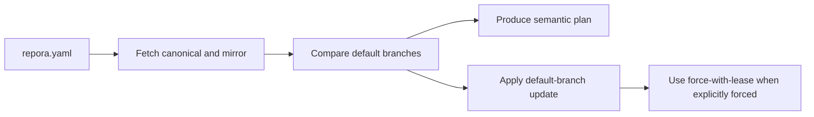

# Repora / repoctl

> Experimental, deterministic Git repository mirror control.


## Overview

**Repora** is an early-stage project for managing repository state through explicit observation, planning, policy, execution, and evidence.

**repoctl** is the current Go CLI prototype. Each configured repository currently compares and synchronizes one GitLab canonical default branch to exactly one configured GitHub or GitLab mirror. Multiple repository entries may be processed in one invocation with bounded concurrency.

The broader repository-control-plane model described below is the project direction, not the current feature set.

## Implemented today

The current CLI supports:

- strict YAML configuration parsing
- multiple configured repository entries per invocation
- bounded concurrent repository processing
- stable repository identity using `id` and optional durable `uid`
- one GitLab canonical repository per entry
- exactly one GitHub or GitLab mirror per entry
- system Git authentication and credential handling
- local bare mirror caching
- default-branch status classification:
  - `EQUAL`
  - `BEHIND`
  - `AHEAD`
  - `DIVERGED`
- plan output for a behind mirror
- dry-run apply
- normal default-branch push when the mirror is behind
- explicit `--force` handling for ahead or diverged mirrors
- force-with-lease protection against stale target overwrites
- human-readable and JSON output
- top-level help through `repoctl --help`, `repoctl -h`, or `repoctl help`

## Current limitations

Repora is pre-alpha and should not yet be treated as a general Git mirror, repository control plane, or production governance service.

Current limitations include:

- URL-based configuration rather than provider/path topology
- GitLab-only canonical repositories
- one mirror per configured repository
- default branch only
- no tag synchronization
- no deleted-ref reconciliation
- no complete ref inventory
- plan and apply do not yet consume one serialized plan artifact
- no durable execution journal
- no explicit branch/ref policy model
- no Anthesis policy integration
- no release binaries or compatibility guarantee for JSON output

The existing `--force` path is transitional. It uses force-with-lease, but it is not yet constrained by the planned branch/ref policy and approval model.

## Current workflow



The target architecture moves to a single plan artifact consumed by apply:


See [`docs/architecture/mirror-workflow-semantics.md`](docs/architecture/mirror-workflow-semantics.md) for the intended mirror-controller semantics.

## Development

This project uses [mise](https://mise.jdx.sh/) to manage development tools and tasks.

```bash
mise install
mise run fmt
mise run lint
mise run test
mise run build
```

The project can also be built and tested directly with Go tooling.

## Current configuration

The runtime still uses explicit remote URLs:

```yaml
repos:
  - id: anthesis
    uid: repo.anthesis
    canonical:
      provider: gitlab
      url: https://gitlab.com/micrantha/anthesis.git
    mirrors:
      - provider: github
        url: https://github.com/hackelia-micrantha/anthesis.git
    mode: mirror
```

Credentials must not be embedded in `repora.yaml`. Authentication is delegated to system Git and configured credential helpers.

The planned provider/path schema will make logical locations authoritative and resolve transport URLs at runtime.

## CLI

Show the implemented command surface with:

```bash
repoctl --help
```

Primary workflows:

```bash
repoctl status -f repora.yaml
repoctl plan -f repora.yaml
repoctl apply -f repora.yaml --dry-run
repoctl apply -f repora.yaml
repoctl sync -f repora.yaml
```

`sync` is currently an alias for `apply`. Top-level help is also available through `repoctl -h` and `repoctl help`.

Commands such as generalized `diff`, continuous `drift`, repository bootstrapping, and policy management remain planned work.

## Product direction

Repora is intended to become a local-first repository controller with these properties:

- **Deterministic** — identical topology, observations, and policy produce the same plan
- **Idempotent** — safe operations converge without unnecessary mutation
- **Reviewable** — mutation intent is represented before execution
- **Stale-safe** — apply rejects changed target state rather than silently re-planning
- **Auditable** — plans, decisions, leases, and outcomes can be journaled
- **Policy-driven** — destructive or sensitive operations fail closed unless explicitly authorized

Potential managed domains include:

- Git ref reconciliation
- selected deterministic repository artifacts
- CI/CD and security baseline assessment
- repository posture evidence
- deterministic context routing for AI-assisted work

These domains will share the planner, policy, execution, and evidence substrate rather than becoming independent mutation paths.

## Document routing

Repora includes a repository-local deterministic document-routing definition intended to reduce retrieval noise for AI-assisted workflows.

Artifacts:

- `.repora/document-router.yaml`
- `schemas/document-router.schema.json`
- `docs/routing/document-routing.md`
- `prompts/document-routing-overlay.md`

The routing model is currently a specification and repository convention. Advanced features such as trust tiers, context receipts, hierarchical summaries, subsystem manifests, and AST-aware routing remain planned.

Core routing principles:

- route before retrieval expansion
- explicit include and exclude rules
- bounded file, byte, and token budgets
- deterministic ordering and pruning
- canonical-document preference
- prompt and generated-content boundaries

## Repository and CI/CD posture

Repora can model repository security posture, CI/CD posture, mirror management, documentation hygiene, commit-history evidence, and local workflow controls as declarative repository state.

The posture model is documented in [`docs/posture.md`](docs/posture.md). It covers normalized repository facts, CI/CD hardening checks, mirror drift, README and documentation hygiene, commit analysis, hook expectations, policy evaluation, exceptions, remediation plans, and the boundary between read-only checks and provider mutation.

The goal is not to replace specialized scanners, documentation linters, or commit-forensics tools. Repora should orchestrate posture tools, normalize their findings, and produce reviewable reports, issues, PRs, or guarded provider-setting changes.

## Security model

Repository mutation is privileged. Current and planned controls follow these principles:

- least privilege
- credentials delegated to system Git
- no credentials stored in `repora.yaml`
- explicit mutation boundaries
- reviewable intent before mutation
- force-with-lease for explicitly forced default-branch updates
- fail-closed handling for unsupported or ambiguous states
- deterministic routing allowlists for AI context

Threats under consideration include:

- unauthorized repository mutation
- stale-plan overwrites
- deletion or rewrite of durable refs
- over-broad Git credentials
- supply-chain injection through templates
- unsafe plugin execution
- prompt injection through repository content
- context poisoning through generated, archived, or external artifacts

Planned mitigations include explicit ref policy, durable journals, approvals, policy attestations, signed artifacts, sandboxed extensions, and context receipts.

## Roadmap

The ordered implementation path is maintained in [`docs/roadmap/ordered-implementation-path.md`](docs/roadmap/ordered-implementation-path.md).

The immediate critical path is:

1. define mirror workflow semantics
2. introduce provider/path transport resolution
3. separate topology, observation, planning, and execution
4. stabilize versioned JSON contracts
5. make one serialized plan the apply boundary
6. add stale-plan validation and execution journaling
7. enforce explicit branch/ref policy
8. expand to multiple mirrors
9. integrate optional Anthesis policy evaluation
10. harden and package a v0.1 release

## License

This project is licensed under the **Business Source License 1.1 (BSL)**.

- Free for personal and internal use
- Commercial or SaaS use requires a license
- Converts to Apache-2.0 on 2029-01-01

See [LICENSE](./LICENSE) for details.

## Project status

Pre-alpha and actively evolving. Expect breaking changes, schema iteration, and architecture refinement.

External contributions are currently closed while the core model stabilizes. Issues describing concrete use cases and failure modes are welcome.

Micrantha Software — [micrantha.com](https://micrantha.com)
