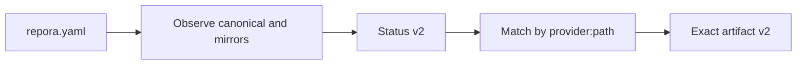
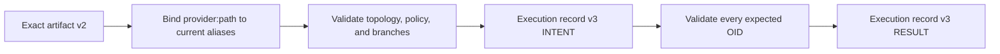

# Repora / repoctl

> Experimental, deterministic Git repository mirror control.


## Overview

**Repora** manages repository state through explicit topology, observation, policy, exact planning, stale-safe execution, and durable evidence.

**repoctl** is the current Go CLI prototype. A repository entry has one GitLab canonical and one or more GitHub/GitLab mirrors. Status, exact planning, and audited dry-run support multiple mirrors. Real apply/sync mutation remains explicitly single-mirror until independent partial-result semantics are complete.

Repora is pre-alpha. The broader repository-control-plane model is product direction, not a claim about current runtime capability.

## Implemented today

- strict YAML parsing and validation;
- multiple repository entries with bounded concurrency;
- durable `uid` identity separate from location;
- provider-relative `provider + path` topology;
- one or more unambiguous GitHub/GitLab mirrors;
- stable mirror selectors such as `github:org/repository`;
- bounded single-mirror legacy URL compatibility;
- runtime HTTPS resolution and system Git authentication;
- independent per-mirror default-branch states: `EQUAL`, `BEHIND`, `AHEAD`, `DIVERGED`, and `ERROR`;
- mirror-local status failure isolation and `repora.status` v2;
- closed ref-policy v1: default branch only, destructive intent requires force for real mutation;
- deterministic reconciliation artifact v2 with provider/path-bound actions;
- exact multi-mirror `plan --artifact` output;
- current-target rebinding by provider/path rather than artifact alias or array position;
- complete multi-target topology, policy, default-branch, and OID preflight;
- audited multi-mirror `apply|sync --dry-run` with zero mutation;
- execution-record v3 with path-bound intent/result evidence;
- historical artifact v1 and execution-record v1/v2 parsing support;
- single-mirror normal pushes and explicit lease-protected overwrites;
- fail-closed immutable journal persistence and nonzero failure status.

## Current limitations

- GitLab canonical repositories only;
- built-in GitHub/GitLab transport bases only;
- path-based operations use HTTPS by default;
- no user-selectable transport or provider bases;
- real multi-mirror apply/sync mutation is not yet enabled;
- multi-mirror dry-run has human output only; per-target apply JSON is not yet published;
- default branch only;
- no tags, wildcard refs, deleted-ref reconciliation, or complete ref inventory;
- no provider provisioning;
- no cross-remote transaction or rollback;
- no Anthesis policy integration;
- no supported release binaries or compatibility guarantee beyond committed versioned schemas.

## Current workflow

### Inspect and plan one or more mirrors



One mirror failure remains visible as `ERROR` and does not hide later mirrors. Incomplete selected observation suppresses executable artifact output.

### Audit a multi-mirror plan without mutation



Artifact aliases and mirror positions are not target authority. A stale later target produces ordered skipped/stale evidence and zero pushes.

### Apply one mirror


Real multi-mirror apply/sync still fails before observation rather than choosing the first mirror implicitly.

## Configuration

```yaml
repos:
  - id: anthesis
    uid: repo.anthesis
    canonical:
      provider: gitlab
      path: micrantha/anthesis
    mirrors:
      - provider: github
        path: hackelia-micrantha/anthesis
      - provider: gitlab
        path: micrantha-backup/anthesis
    mode: mirror
    policy:
      refs:
        version: 1
        scope: default-branch-only
        destructive: require-force
```

`id` is the operational label. `uid` is durable identity. Provider/path is durable target identity. Array position and Git aliases are deterministic runtime details only.

Credentials must not be embedded in configuration. Authentication is delegated to system Git and credential helpers.

See [`docs/configuration/provider-path-topology-v1.md`](docs/configuration/provider-path-topology-v1.md).

## CLI

```bash
repoctl status -f repora.yaml
repoctl status -f repora.yaml --json

repoctl plan -f repora.yaml
repoctl plan -f repora.yaml --artifact > plan.json

repoctl apply -f repora.yaml --dry-run
repoctl apply -f repora.yaml --plan-file plan.json --dry-run

# Real mutation currently requires a single-mirror configuration.
repoctl apply -f single-mirror.yaml --plan-file plan.json
repoctl apply -f single-mirror.yaml --plan-file plan.json --force
```

`sync` is currently an alias for `apply`.

Multi-mirror `apply --dry-run --json` is intentionally rejected until a versioned per-target apply result contract is available.

Exit codes:

- `0`: success;
- `1`: operational, validation, stale, journal, execution, or output failure;
- `2`: complete unsafe status/planning or missing authorization for a destructive real mutation.

## Contracts and architecture

- [Current architecture](docs/architecture/current-system.md)
- [Multi-mirror status](docs/architecture/multi-mirror-status.md)
- [Failure and recovery semantics](docs/architecture/failure-semantics.md)
- [Exact reconciliation artifact](docs/architecture/reconciliation-plan-artifact.md)
- [Execution journal](docs/architecture/execution-journal.md)
- [Closed ref policy](docs/architecture/ref-policy.md)
- [Active implementation plan](docs/plans/current.md)
- [Architecture decision index](docs/decisions/README.md)
- [Versioned schemas](schemas/)

## Development

Repora uses [mise](https://mise.jdx.sh/) for tool and task management.

```bash
mise install
mise run fmt
mise run lint
mise run test
mise run build
```

Direct Go tooling is also supported.

## Security model

Current controls include:

- credentials delegated to system Git;
- credential-bearing HTTP URLs rejected;
- stable identity separated from transport and runtime aliases;
- closed default-branch-only ref policy;
- destructive intent visible in the exact artifact;
- explicit force authorization for real mutation;
- complete all-target preflight;
- force-with-lease defense in depth;
- fail-closed journal intent persistence;
- path-bound execution evidence;
- sanitized diagnostics and safe relative evidence references;
- strict denial of implicit multi-mirror mutation.

## Roadmap

Immediate critical path:

1. independent ordered multi-mirror mutation with continuation after runtime failure;
2. versioned per-target apply output and applied/failed/skipped journal evidence;
3. v0.1 release packaging, checksums, verification, and installation guidance.

The authoritative order is maintained in [`docs/plans/current.md`](docs/plans/current.md) and GitHub issues.

## License

Business Source License 1.1:

- free for personal and internal use;
- commercial or SaaS use requires a license;
- converts to Apache-2.0 on 2029-01-01.

See [LICENSE](LICENSE).

## Project status

Pre-alpha and actively evolving. Expect explicit version migrations and architecture refinement.

External contributions are currently closed while the core model stabilizes. Concrete use cases and failure reports are welcome.

Micrantha Software — [micrantha.com](https://micrantha.com)
