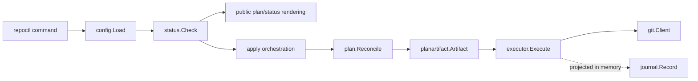

# Current system architecture

Status: Current

This document describes the merged Repora implementation and its current package boundaries. Future architecture belongs in proposals or ADRs until it is implemented.

## Product boundary

Repora is currently a local-first Git mirror controller exposed through the `repoctl` Go CLI.

For each configured repository entry, it supports:

- one GitLab canonical repository;
- exactly one GitHub or GitLab mirror;
- provider-relative `provider + path` topology, with bounded legacy URL compatibility;
- runtime HTTPS transport resolution;
- the repositories' resolved default branches only;
- `EQUAL`, `BEHIND`, `AHEAD`, and `DIVERGED` classification;
- normal pushes for behind mirrors;
- explicitly forced, lease-protected overwrites for ahead or diverged mirrors;
- concurrent processing of multiple independent repository entries.

It does not currently provide general ref mirroring, tags, deleted-ref reconciliation, multi-mirror execution, provider provisioning, or a hosted control plane.

## Runtime flow



The executable apply path is:

```text
configuration
  -> runtime transport resolution
  -> fetched reference observation and classification
  -> full branch/OID observation for apply
  -> deterministic reconciliation plan
  -> validated versioned plan artifact
  -> complete structural and stale-ref preflight
  -> ordered Git mutation
  -> structured execution result
```

## Package ownership

| Package | Owns | Must not own |
| --- | --- | --- |
| `internal/config` | YAML decoding, durable repository identity, topology validation, supported provider/cardinality constraints | Runtime URL derivation or Git operations |
| `internal/transport` | Runtime conversion from provider/path endpoints to transport URLs | Durable identity, credentials, planning, or mutation |
| `internal/status` | Cache preparation, remote configuration/fetch, remote HEAD setup, divergence classification, short commit observations | Mutation decisions or pushes |
| `internal/plan` | Deterministic reconciliation decisions and action preconditions | Git reads, Git writes, or durable serialization policy |
| `internal/planartifact` | Versioned durable representation, strict parsing, validation, and conversion of reconciliation plans | Repository observation or execution policy |
| `internal/executor` | Complete plan validation, stale-ref preflight, ordered mutation, and action outcomes | Recomputing status or reconciliation decisions |
| `internal/apply` | Observation-to-plan orchestration, compatibility output projection, artifact handoff, and repository-level result assembly | Independent reconciliation policy |
| `internal/journal` | Versioned execution evidence, executor-result projection, and append-only local persistence of validated records | Mutation authority, replay authority, or current apply orchestration |
| `internal/git` | Bounded Git subprocess execution, cache filesystem safety, ref reads, pushes, lease enforcement, timeout/cancellation, and diagnostic redaction | Product policy or repository identity |
| `cmd/repoctl` | CLI parsing, multi-repository concurrency, output rendering, and process exit semantics | Git mechanics or duplicated planning logic |

Dependencies should continue to point from orchestration toward domain and infrastructure boundaries, not back from infrastructure into the CLI.

## Identity and location

Repora distinguishes three concepts:

- `id`: human-facing operational alias;
- `uid`: durable logical repository identity for cache and evidence continuity;
- provider/path or resolved URL: current repository location and runtime transport state.

Resolved URLs are not durable identity and must not be serialized into plans or journals. Credential handling remains delegated to system Git.

## Observation and planning

`status.Check` prepares the local bare cache, fetches canonical and mirror remotes, sets their remote HEAD references, and classifies the default-branch relationship.

Apply then resolves the branch names and full source/target OIDs required to build stale-safe actions. `plan.Reconcile` produces zero or one `PUSH_BRANCH` action for the current single-mirror implementation.

Dry-run and real apply share this observation-to-plan path. Real apply converts the same in-memory plan into a validated `repora.io/reconciliation-plan` artifact before execution.

## Known planning split

The public `repoctl plan` command currently emits a compatibility preview derived from status results. It is not the same serialized plan artifact consumed by the executor and does not include full OID preconditions or forced actions.

This is a deliberate compatibility constraint in the current source, but not the desired long-term boundary. The reviewable CLI plan should eventually render or export the exact executable artifact rather than maintain an independent action representation.

## Execution safety

Before action zero mutates a remote, the executor:

1. validates the artifact envelope and repository cardinality;
2. validates every converted action;
3. resolves every expected source and target ref;
4. rejects the complete execution if any ref is missing or stale.

A forced action additionally uses `--force-with-lease` against the observed target OID. The remote-side lease is defense in depth; it does not replace complete preflight.

Mutation stops after the first runtime failure. Earlier successes remain `APPLIED`, the failing action is `FAILED`, and later actions remain `SKIPPED`.

## Journal boundary

The journal implementation defines:

- a versioned `repora.io/execution-record` model;
- an exact SHA-256 reference to the serialized plan artifact;
- repository identity and ordered before/desired/after action evidence;
- `PLANNED`, `APPLIED`, `FAILED`, `SKIPPED`, and `STALE` outcomes;
- validated projection from executor results with diagnostic redaction;
- append-only filesystem persistence for an already validated record beneath a caller-owned root.

The writer provides a safe relative reference, restrictive permissions, no-replace publication, symlink-component rejection, and explicit post-publication error semantics. Apply does not yet require, persist, or expose execution records, so writer availability alone does not make apply audited. A journal record is evidence of intent and outcome, never authority to replay a stale operation.

## Concurrency model

The CLI bounds repository-level concurrency with `--parallel`. Each configured repository is processed independently, while aggregate output is restored to configuration order.

There is no cross-repository transaction. A future multi-mirror implementation must also report partial success explicitly rather than imply atomicity across remotes.

## Public contracts

Status, plan, and apply JSON outputs use versioned envelopes and published schemas. The executable reconciliation artifact has a separate versioned schema.

Compatibility serializers are views over current behavior; they must not become alternate planning authorities.

## Security boundaries

Current controls include:

- strict YAML and JSON parsing;
- rejection of credential-bearing configured HTTP URLs;
- runtime-only transport URLs;
- safe encoded cache paths and symlink checks;
- bounded Git subprocesses and process cleanup;
- diagnostic credential redaction;
- full action preflight before mutation;
- explicit force gating and force-with-lease;
- strict artifact validation and sensitive-value rejection;
- least-privilege, SHA-pinned GitHub Actions.

## Immediate architecture gaps

The highest-priority gaps are:

1. make the public plan surface represent the exact executable artifact;
2. preserve detailed executor outcomes through public apply results;
3. integrate pre/post execution journaling with fail-closed write behavior;
4. define and enforce explicit branch/ref policy;
5. remove silently ignored observation evidence failures;
6. expand to multi-mirror status before multi-mirror apply.

Managed artifacts, advanced document routing, repository assessments, and Anthesis integration remain deferred product tracks. They must reuse the plan, policy, execution, and evidence boundaries rather than introduce independent mutation paths.
