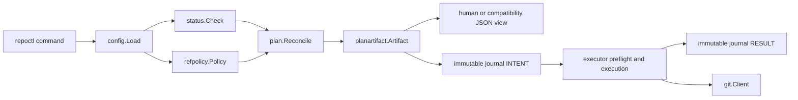

# Current system architecture

Status: Current

This document describes the merged Repora implementation and its current package boundaries. Future architecture belongs in proposals or ADRs until implemented.

## Product boundary

Repora is a local-first Git mirror controller exposed through the `repoctl` Go CLI.

For each configured repository entry, it currently supports:

- one GitLab canonical repository;
- exactly one GitHub or GitLab mirror;
- provider-relative `provider + path` topology, with bounded legacy URL compatibility;
- runtime HTTPS transport resolution;
- the repositories' resolved default branches only;
- `EQUAL`, `BEHIND`, `AHEAD`, and `DIVERGED` classification;
- normal pushes for behind mirrors;
- explicitly authorized, lease-protected overwrites for ahead or diverged mirrors;
- exact executable plan artifact export and import;
- fail-closed immutable intent/result journal evidence;
- concurrent processing of multiple independent repository entries.

It does not currently provide tags, non-default branches, deleted-ref reconciliation, multi-mirror execution, provider provisioning, or a hosted control plane.

## Runtime flow



The executable apply path is:

```text
configuration and closed ref policy
  -> runtime transport resolution
  -> fetched reference observation and classification
  -> full default-branch/OID observation
  -> deterministic reconciliation plan
  -> validated versioned plan artifact
  -> required immutable intent evidence
  -> complete structural and stale-ref preflight
  -> ordered Git mutation or dry-run validation
  -> required immutable result evidence
  -> structured public result and process status
```

## Package ownership

| Package | Owns | Must not own |
| --- | --- | --- |
| `internal/config` | YAML decoding, durable repository identity, topology validation, and ref-policy normalization | Runtime URL derivation or Git operations |
| `internal/refpolicy` | Closed versioned ref scope and relationship-to-intent decisions | Git reads, Git writes, provider APIs, or CLI authorization parsing |
| `internal/transport` | Runtime conversion from provider/path endpoints to transport URLs | Durable identity, credentials, planning, or mutation |
| `internal/status` | Cache preparation, remote configuration/fetch, remote HEAD setup, divergence classification, and commit evidence | Mutation decisions or pushes |
| `internal/plan` | Deterministic reconciliation actions, preconditions, and the plan compatibility projection | Git reads, Git writes, or durable serialization policy |
| `internal/planartifact` | Versioned durable representation, strict parsing, validation, and plan conversion | Repository observation or execution policy |
| `internal/executor` | Complete plan validation, stale-ref preflight, ordered mutation, and action outcomes | Recomputing status or reconciliation decisions |
| `internal/apply` | Observation-to-artifact orchestration, artifact/config validation, execution delegation, audit integration, and public result assembly | Independent reconciliation policy |
| `internal/journal` | Versioned intent/result evidence, executor projection, redaction, and append-only local persistence | Mutation authority or replay authority |
| `internal/git` | Bounded Git subprocesses, cache safety, ref reads, pushes, leases, timeout/cancellation, and diagnostic redaction | Product policy or durable repository identity |
| `cmd/repoctl` | CLI parsing, repository concurrency, artifact export/import, output rendering, audit root/ID initialization, and exit semantics | Git mechanics or duplicated planning logic |

Dependencies should point from orchestration toward domain and infrastructure boundaries, not back from infrastructure into the CLI.

## Identity and location

Repora distinguishes:

- `id`: human-facing operational alias;
- `uid`: durable logical repository identity for cache and evidence continuity;
- provider/path: declarative repository location;
- resolved URL and Git remote alias: runtime transport state.

Resolved URLs are not durable identity and are excluded from plans and journals. Credential handling remains delegated to system Git.

## Reference policy

Reference policy version 1 has one accepted interpretation:

- `scope: default-branch-only`;
- `destructive: require-force`.

Omitting the policy normalizes to these values. Unsupported versions, broader scopes, or permissive destructive modes fail configuration loading.

The planner maps current relationship to no action, a normal push, or a forced overwrite. Planning describes destructive intent; a real mutation separately requires `--force`. Dry-run may review and stale-check destructive intent without authorizing mutation.

Tags, wildcard refspecs, non-default branches, and deleted-ref reconciliation remain denied.

## Observation and planning

`status.Check` prepares the local bare cache, fetches canonical and mirror remotes, resolves their default branches, classifies their relationship, and returns required canonical/mirror commit evidence. Incomplete required evidence fails the repository check.

The observation-to-artifact path resolves full source and target OIDs. `plan.Reconcile` produces zero or one `PUSH_BRANCH` action for the current single-mirror implementation. `planartifact.FromPlans` creates the exact validated executor input.

`repoctl plan --artifact` exports that artifact. `repoctl apply --plan-file` refreshes selected repository state, validates artifact ownership and authorization, and executes the supplied artifact without rebuilding intent. Convenience apply and dry-run use the same artifact-backed execution path.

## Compatibility views

`repoctl plan --json` remains `repora.plan` version 1. It is projected from the exact plan and is not an alternate decision authority.

Human plan output is also a compatibility view. Exact branches, observed/desired OIDs, force intent, and executor input are available through `--artifact`.

## Execution safety

Before action zero can mutate a remote, execution:

1. validates artifact kind, version, and repository cardinality;
2. matches durable repository UID and configured topology;
3. validates current state against action count and force intent;
4. requires `--force` for a real forced action;
5. validates current default-branch scope;
6. persists immutable intent evidence;
7. resolves every expected source and target OID;
8. rejects the complete execution if any ref is stale.

A forced action also uses `--force-with-lease` against the observed target OID. The lease is defense in depth and does not replace preflight.

## Execution journal

CLI apply and dry-run use one command-level execution ID. Each repository operation writes append-only version-2 records beneath the directory containing the loaded configuration:

```text
.repora/journal/<uid>--<execution-id>--intent.json
.repora/journal/<uid>--<execution-id>--result.json
```

Required intent persistence occurs before executor preflight can reach mutation. Intent-write failure is fail-closed. Runtime and stale failures still attempt result persistence. Result-write failure returns nonzero even if mutation completed.

Journal records contain a digest of the exact plan, ordered before/desired/after evidence, sanitized diagnostics, and explicit outcomes. They are evidence for recovery analysis, never authority to replay an operation. Recovery always re-observes and re-plans current state.

## Concurrency and atomicity

The CLI bounds repository-level concurrency with `--parallel`. Results are restored to configuration or artifact order.

There is no cross-repository transaction. The current executor stops after the first action failure within a repository plan. Future multi-mirror execution must explicitly define per-mirror continuation and partial success; it must not imply atomicity or rollback across remotes.

## Public contracts

Status, compatibility plan, apply, execution records, and exact plan artifacts use versioned envelopes and committed schemas where public. Historical schemas remain available when contracts advance.

Compatibility serializers are views over artifact-backed behavior, not alternate policy or planning authorities.

## Immediate architecture gaps

The highest-priority gaps are:

1. multi-mirror status with stable target identity and failure isolation;
2. multi-mirror exact planning/execution with per-mirror results and evidence;
3. public action-level apply outcomes where required by the multi-mirror contract;
4. supported release packaging and verification.

Managed artifacts, advanced document routing, repository assessments, and Anthesis integration remain deferred product tracks. They must reuse the plan, policy, execution, and evidence boundaries rather than introduce independent mutation paths.
