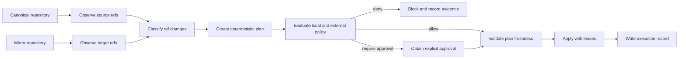

# Mirror Workflow Semantics

## Status

Proposed design for Repora's first production-oriented reconciliation boundary.

This document defines the semantics for issue #29. It describes the intended behavior of Repora as a deterministic Git mirror controller. It does not claim that all behavior described here is implemented.

## Scope

Repora synchronizes a canonical Git repository to one or more configured mirrors. The canonical repository is the source of desired Git state. Every mirror is evaluated independently.

The first implementation remains conservative:

- default branch only
- tags denied
- ref deletion denied
- non-fast-forward updates denied unless explicitly authorized
- no cross-mirror transaction
- no implicit provider-side policy bypass

Future branch, tag, and multi-mirror support must preserve the decision model in this document.

## Mental model



Repora must never treat `git push --mirror` as the planning model. Git commands are executor mechanisms used only after Repora has classified and authorized each intended ref mutation.

## Terminology

- **Canonical repository**: authoritative source of desired Git state.
- **Mirror**: independently reconciled target repository.
- **Observation**: immutable snapshot of relevant source and target refs and object IDs.
- **Plan**: versioned artifact describing intended mutations against an observation.
- **Policy decision**: deterministic allow, deny, or approval-required result.
- **Lease**: expected target object ID used to reject stale execution.
- **Execution record**: append-only evidence of planning and execution outcome.

## Workflow phases

### 1. Resolve topology

Repora resolves configured provider/path references to runtime Git remotes. Credentials remain delegated to system Git or a credential helper and must not be written into plans, logs, or journals.

### 2. Observe source and target

For every eligible ref, Repora records:

- source ref name and object ID
- target ref name and object ID, if present
- source and target repository identity
- observation timestamp
- selected synchronization policy

Observation errors are isolated per mirror. A failed mirror observation must not be represented as an empty or deleted target.

### 3. Classify each ref

Every candidate ref is classified before mutation:

| Classification | Meaning | Default decision |
| --- | --- | --- |
| `equal` | Source and target point to the same object | no-op |
| `create` | Source exists and target does not | allow when ref is in policy scope |
| `fast-forward` | Target is an ancestor of source | allow when ref is in policy scope |
| `target-ahead` | Source is an ancestor of target | deny |
| `diverged` | Neither side is an ancestor of the other | deny |
| `delete` | Target exists and source does not | deny |
| `rewrite` | Update is non-fast-forward or tag target changes | deny |
| `unsupported` | Ref kind or object type is outside supported semantics | deny |

Classification must be based on object IDs and ancestry, not only ahead/behind display counts.

### 4. Build a deterministic plan

The planner creates a versioned plan artifact. For identical topology, observations, and policy, the serialized plan must be deterministic except for explicitly non-semantic metadata such as creation time or execution ID.

Each planned mutation includes:

- repository `uid` and human-facing `id`
- mirror identity
- source and target refs
- observed source and target object IDs
- classification
- destructive flag
- required lease
- policy decision and reason
- human-readable explanation

Dry-run and apply must consume this same plan. Apply must not reconstruct intent independently.

### 5. Evaluate policy

Policy is deny-by-default outside the configured synchronization scope.

The local policy boundary evaluates:

- branch and tag allowlists
- protected refs
- force/rewrite rules
- deletion rules
- actor and automation context when available
- whether an external policy decision is required

An Anthesis integration may provide an additional deterministic decision. Repora remains responsible for enforcement. Invalid, unavailable, ambiguous, or expired policy decisions fail closed when external policy is configured as required.

### 6. Validate plan freshness

Immediately before execution, Repora re-reads every target ref and compares it with the plan's lease.

Execution is rejected as `stale-plan` when:

- the target object ID changed
- a previously missing target ref appeared
- a previously existing target ref disappeared
- relevant policy changed
- the plan schema or compatibility version is unsupported

Repora must never silently re-plan during apply. The operator or automation must produce and review a new plan.

### 7. Execute mutations

The executor applies only authorized plan operations.

Execution requirements:

- use explicit refspecs
- use force-with-lease for every authorized non-fast-forward operation
- never use unqualified force
- preserve per-mirror isolation
- stop executing dependent operations after a failure
- report partial success explicitly
- avoid provider-specific protection bypasses unless separately configured and evidenced

Cross-mirror atomicity is not promised. Each mirror produces its own outcome.

### 8. Journal the outcome

Every plan and apply run emits an append-only execution record containing:

- plan identity and digest
- topology and repository identity
- observations and leases
- policy decisions
- approval references, when applicable
- attempted operations
- applied, skipped, blocked, stale, and failed outcomes
- before and after object IDs
- sanitized error details

Secrets, credential-bearing URLs, and arbitrary repository content must not be copied into the journal.

## Default synchronization policy

Until explicit branch/ref policy is implemented, the compatible target policy is:

```yaml
sync:
  branches:
    mode: default-only
  tags:
    mode: deny
  deletions:
    mode: deny
  force:
    mode: deny
```

The existing `--force` behavior is transitional. It must eventually be constrained by an explicit policy decision and represented in the plan and journal.

## Failure semantics

Repora fails closed for mutation safety:

- topology resolution failure: no plan for the affected repository
- source observation failure: no mutation for any dependent mirror
- mirror observation failure: no mutation for that mirror
- unsupported ref state: blocked
- policy evaluation failure: blocked when policy is required
- stale plan: blocked; never automatically re-planned
- journal failure: blocked when audit is configured as required
- executor failure: record partial outcome and stop dependent operations

Read-only status may continue for unaffected repositories and mirrors.

## Status model

Status should distinguish repository health from mutation eligibility. A mirror can be observable but not safely reconcilable.

Recommended status fields include:

- observation state
- per-ref classification counts
- policy eligibility
- plan availability
- last execution outcome
- last successful synchronization object IDs
- error classification

Aggregate status must not hide per-mirror failure or partial success.

## Security invariants

1. No mutation without a versioned plan.
2. No apply path that independently reconstructs the plan.
3. No stale target overwrite.
4. No deletion, tag rewrite, or non-fast-forward update by default.
5. No credential material in configuration artifacts, plans, logs, or journals.
6. No ambiguous policy decision treated as allow.
7. No repository-wide mirror push used as a shortcut around ref classification.
8. Every attempted mutation has durable evidence when journaling is enabled.

## Implementation sequence

1. Introduce provider/path transport resolution (#16).
2. Separate topology, observation, planning, and execution (#22).
3. Stabilize versioned JSON contracts (#3).
4. Implement the serialized plan artifact and freshness validation (#8).
5. Add filesystem execution journaling (#1).
6. Define and implement branch/ref policy (#4 and #2).
7. Expand status and apply to multiple mirrors (#13 and #15).
8. Add optional Anthesis policy integration (#30).

## Acceptance mapping

This design establishes:

- explicit source and target ownership
- ref-level classification semantics
- conservative destructive-change defaults
- deterministic plan and apply boundaries
- stale-plan rejection
- per-mirror isolation and partial-success semantics
- policy enforcement points
- durable evidence requirements
- a bounded implementation sequence
