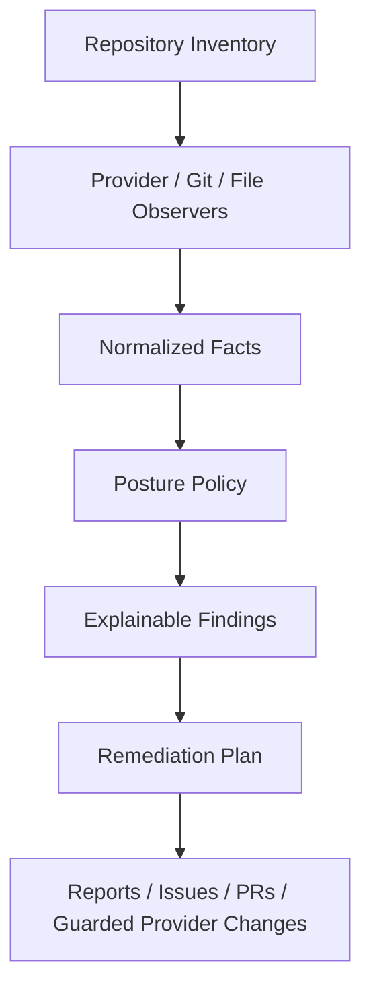

# Repository and CI/CD Posture

Repora treats repository security posture and CI/CD posture as declarative repository state, not as a standalone scanner.

The architecture is intentionally layered: collect normalized facts first, then evaluate explicit policy, then produce findings and reviewable remediation. Fact collectors do not decide whether observed state is acceptable.

## Implementation status

Current fact collectors are:

- `repoctl posture inventory OWNER/REPO` → `repora.posture-inventory` v1 for GitHub repository/CI facts;
- `repoctl posture docs OWNER/REPO` → `repora.posture-documentation` v1 for deterministic documentation/README facts;
- `repoctl posture hooks OWNER/REPO` → `repora.posture-hooks` v1 for bounded hooks/local-workflow facts;
- `repoctl posture mirrors -f repora.yaml` → `repora.posture-mirrors` v1 from declared Repora topology and existing mirror reconciliation evidence.

All posture domains preserve `observed`, `unknown`, and `unavailable` evidence. Provider API collection is read-only. Mirror posture may refresh Repora's local bare cache for observation, but it does not push or synchronize repositories. Hooks posture reads hook/config/document/workflow content only as bounded data and never installs or executes target-repository hook code.

Commit/process facts remain next. Policy evaluation, findings, Markdown reports, automatic issue/PR remediation, provider mutation, and broad non-GitHub provider-administration adapters are not implemented yet.

## Goals

Posture work should support recurring repository stewardship across these domains:

- **Repository security** — branch protection, ownership, dependency automation, access boundaries, release hygiene, and security metadata.
- **CI/CD security** — workflow permissions, runner trust, third-party actions, privileged events, deployment boundaries, and supply-chain controls.
- **Mirror management** — canonical/mirror identity, default-branch and commit drift, remotes, provider metadata, and synchronization expectations.
- **Documentation hygiene** — required docs, README shape, configured links, stale metadata signals, and canonical-document authority.
- **Commit/process analysis** — bounded evidence about risky change patterns and declared-vs-observed process without developer scoring or intent inference.
- **Hooks/local workflow** — configured local safeguards and their relationship to authoritative CI enforcement.

These concerns should remain facts, policies, findings, and remediation plans rather than opaque scoring.

## Non-goals

Repora should not replace specialized scanners or execute them implicitly. Later layers may normalize outputs from tools such as Gitleaks, Semgrep, OSV-Scanner, Trivy, OpenSSF Scorecard, or Sigstore, but current posture collectors do not run scanners.

Repora also does not use posture analysis for developer productivity scoring, identity profiling, intent inference, or automatic provider mutation.

## Mental model



The important boundary is between **facts** and **policy**. Facts describe observed state. Policies decide whether that state is acceptable.

## Repository posture

Repository posture facts include or may later include:

- default branch and protection state;
- required status checks and reviews;
- force-push and deletion protection;
- CODEOWNERS, `SECURITY.md`, license, issue/PR templates;
- dependency update automation;
- secret-scanning/provider-security controls where APIs expose them;
- deploy-key and collaborator/access posture where APIs expose them.

The current GitHub inventory implements the default-branch/protection and file-backed metadata subset. Broader provider administration and scanner-specific facts remain future work.

## CI/CD posture

Current GitHub workflow observation includes:

- workflow/job declared permissions;
- `pull_request_target`;
- runner labels, including literal `self-hosted` label evidence;
- action and reusable-workflow references;
- mutable versus immutable action pinning.

It does not infer actual infrastructure from arbitrary runner labels or groups.

Future policy may flag patterns such as privileged untrusted PR execution, mutable third-party actions, broad token permissions, unsafe self-hosted-runner exposure, missing deployment gates, or weak release controls. Those are policy conclusions, not collector behavior.

## Mirror management posture

Mirror management is a separate versioned fact domain because mirrors can silently become security, availability, and provenance risks.

`repora.posture-mirrors` v1 records:

- canonical identity from declared `provider:path` topology;
- declared mirror identities and cache remote names;
- configured `mirror` mode and `canonical_to_mirror` direction;
- canonical and mirror default-branch names where observable;
- canonical and mirror default-branch commit evidence;
- default-branch-name drift;
- the existing `EQUAL`, `BEHIND`, `AHEAD`, and `DIVERGED` reconciliation state with ahead/behind counts;
- provider visibility and authenticated/current-actor push permission where exposed by an implemented adapter;
- tag and release drift as explicit `unknown` facts under the current default-branch-only scope.

The collector reuses `status.CheckAll`; it does not implement a second divergence algorithm. `status.CheckAll` can create or refresh Repora's local bare mirror cache, configure cache remotes, and fetch repository data. Mirror posture does not call push, mirror synchronization, release publication, or provider mutation operations.

For GitHub endpoints, the mirror-specific GET adapter normalizes `default_branch`, `visibility`, and `permissions.push` when GitHub returns them. If actor permissions are omitted, push permission remains `unknown`; omission is not interpreted as `false`. Provider reads hidden by access remain `unavailable`.

GitLab transport/reconciliation evidence is current, but GitLab provider-administration metadata remains `unavailable` until a posture adapter is implemented.

Missing provider metadata never becomes a healthy or drifted conclusion. Default-branch-name drift can still be observed from refreshed Git remote evidence independently of provider-administration metadata.

See [`posture-mirrors.md`](posture-mirrors.md).

## Documentation and README hygiene

Documentation posture v1 can observe:

- repository-profile-selected document presence;
- README presence and configured ATX headings;
- configured repository-relative README links;
- deterministic exact content markers for bounded stale-metadata signals;
- document-router metadata presence and whether its trust subset is usable by documentation posture;
- canonical, implementation, generated, experimental, archived, external, or unclassified trust tiers for selected documents.

A repository may select observations through `.repora/posture-documentation.yaml`. That repository-owned profile chooses facts to collect; it does not assign severity, suppress external policy, or authorize remediation.

Missing facts are observed `false` only when evidence is complete. Truncated or inaccessible evidence remains `unknown` or `unavailable`. Generated and archived documents are not silently promoted to canonical.

Full prose linting, semantic review, metadata inference, and LLM-based documentation judgment remain non-goals for this collector.

## Commit analysis posture

Commit/process analysis should eventually provide bounded evidence such as:

- signed commit and tag prevalence;
- merge strategy patterns;
- commit size and file-scope outliers;
- sensitive-path and release-boundary changes;
- direct-to-main or unreviewed changes where provider APIs expose them;
- relationships between commits, issues, PRs, and releases.

This domain is repository/process risk analysis. It must not become developer productivity scoring, identity profiling, or unsupported intent inference.

## Hooks and local workflow posture

`repora.posture-hooks` v1 observes:

- common manager/config signals for pre-commit, Lefthook, Husky, and custom `.githooks` entrypoints;
- additional repository-declared hook paths and manager expectations from `.repora/posture-hooks.yaml`;
- required local checks and whether their names are observable in GitHub Actions workflow text;
- declared bootstrap-document presence;
- declared bypass/escape-hatch-document presence;
- bounded static network-load signals in hook/config blobs.

The repository profile is observation configuration only. It cannot assign severity, suppress policy, authorize remediation, or make local hooks authoritative.

A CI coverage fact indicates that a declared local-check string is observable in GitHub Actions workflow content. It is evidence of apparent coverage, not proof that the local and CI commands are semantically equivalent. CI remains the enforcement source unless a later explicit policy says otherwise.

Hook content is never installed, sourced, executed, bootstrapped, or followed over the network. Presence is not treated as trust. Executable state remains `unknown` in v1 because the shared GitHub tree reader does not currently normalize file mode; this limitation is explicit rather than inferred.

Missing paths are observed `false` only with complete tree evidence. Truncated or inaccessible evidence remains `unknown` or `unavailable`.

See [`posture-hooks.md`](posture-hooks.md).

## Normalized facts

Versioned posture contracts use explicit evidence state instead of collapsing missing access into `false`:

```json
{
  "state": "observed",
  "value": true,
  "evidence": [
    {
      "source": "github.git_tree",
      "reference": "owner/repo:<tree-sha>"
    }
  ]
}
```

Provider-specific data may remain in evidence, but policy should consume normalized facts where possible.

## Policy evaluation

Policy evaluation is not implemented yet. Future policies should be explicit, versioned, and explainable.

Illustrative shape:

```yaml
posture:
  profiles:
    baseline:
      repository:
        default_branch_protection: required
        required_reviews: 1
        security_md: recommended
      ci:
        default_token_permissions: read
        pin_third_party_actions: required
        pull_request_target: warn
        self_hosted_runners_on_public_prs: deny
```

A future finding should identify the observed fact, expected policy, severity, source evidence, remediation options, and whether automated remediation is safe.

Repository-owned posture observation profiles are deliberately separate from this policy layer.

## Exceptions

Once policy evaluation exists, exceptions should be first-class and require a reason, owner, and expiry. Expired exceptions should become findings rather than silently persisting.

## Remediation plans

Posture remediation must separate observation, planning, and mutation. Candidate future commands include:

```bash
repoctl posture check
repoctl posture plan
repoctl posture report --format markdown
```

A future plan may propose file changes, issues, PRs, or provider-setting changes, but any apply path must remain explicitly reviewed and preserve Repora's diff-first/exact-plan execution model.

## CLI surface

Current posture commands are:

```bash
repoctl posture inventory OWNER/REPO
repoctl posture docs OWNER/REPO
repoctl posture hooks OWNER/REPO
repoctl posture mirrors -f repora.yaml
```

Candidate later surfaces include policy checking/reporting plus focused commit helpers. They should remain posture-oriented rather than becoming a general CI runner, documentation linter, or forensic tool.

## Provider support

| Provider | Current/planned support |
| --- | --- |
| GitHub | Current repository/CI, documentation, and hooks/local-workflow collection; mirror default branch, visibility, and current-actor push permission where returned; broader provider-admin facts planned |
| GitLab | Current Git transport/reconciliation evidence in mirror posture; provider-admin posture metadata planned |
| Bitbucket | Planned branch restrictions, pipelines configuration, and repository metadata |
| Local repositories | Current Repora mirror-cache observation; broader file/config/lockfile evidence planned |

Mirror drift itself remains grounded in Repora's provider-neutral topology and Git reconciliation semantics.

## Security model

Posture management is security-sensitive because later layers may propose changes to repository controls. Current and future work must preserve these boundaries:

- read-only provider fact collection by default;
- local mirror-cache refresh may occur for observation, but posture does not push to repositories;
- no implicit provider mutation;
- explicit plans before writes;
- least-privilege provider tokens;
- no secrets stored in `repora.yaml` or posture evidence;
- provider evidence retained for audit;
- repository-owned observation profiles cannot grant policy or mutation authority;
- hook/config inspection never executes target-repository code;
- clear distinction between file PRs and direct provider API mutations.

Provider API mutation should come only after deterministic facts, policy/reporting, and reviewable file-based remediation are proven.

## Implementation phases

1. **Complete** — read-only GitHub repository/CI inventory and normalized fact/evidence contract.
2. **Complete** — deterministic documentation/README hygiene facts and observation profile.
3. **Complete** — mirror-management drift facts reusing existing topology/status semantics.
4. **Complete** — hooks/local-workflow facts without executing hook code.
5. **Complete** — bounded commit/process-risk facts without productivity scoring or intent inference.
6. **Complete** — explicit offline policy evaluation and deterministic JSON/Markdown reporting over normalized facts.
7. **Later** — issue/PR-backed remediation after reporting is proven through operator acceptance.
8. **Later/separate decision** — guarded provider API mutation.
9. **Later** — broader GitLab and Bitbucket provider-administration adapters.

The active implementation order is maintained in [`plans/current.md`](plans/current.md) and live GitHub issues.
