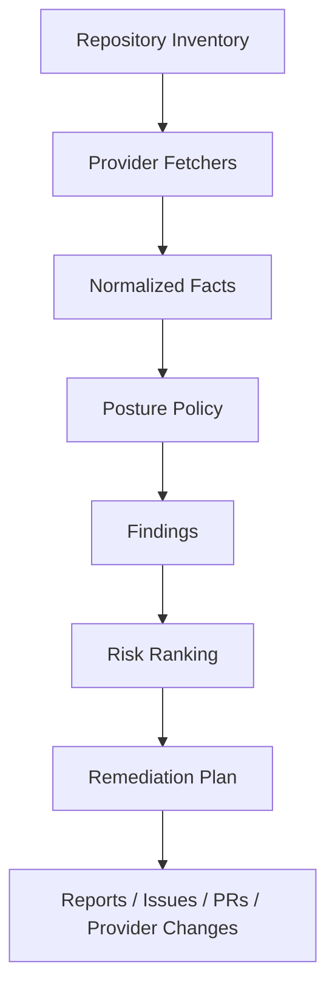

# Repository and CI/CD Posture

Repora should treat repository security posture and CI/CD posture as declarative repository state, not as a standalone scanner.

The goal is to collect normalized facts about repositories, evaluate them against explicit posture policies, and produce reviewable remediation plans.

## Goals

Posture work should make Repora useful for recurring repository stewardship, not only one-time bootstrapping.

Primary goals:

- **Harden repository security** by evaluating branch protection, ownership, access boundaries, secrets posture, dependency automation, release hygiene, and CI/CD trust boundaries.
- **Manage mirrors** by keeping canonical repositories, mirrors, remotes, provider metadata, and synchronization expectations explicit and drift-aware.
- **Maintain documentation and README hygiene** by checking for required docs, stale or missing sections, inconsistent project metadata, and repository-specific documentation expectations.
- **Analyze commit history** by surfacing risky change patterns, large or unusual commits, unsigned or unreviewed changes, release-boundary changes, and drift between declared process and observed history.
- **Govern hooks and local workflow controls** by tracking expected Git hooks, pre-commit checks, local policy entrypoints, and repo-specific developer workflow safeguards.

These goals should be expressed as facts, policies, findings, and remediation plans so they remain auditable and provider-neutral where possible.

## Purpose

Repository posture covers the durable controls around a repository: branch protection, ownership, security metadata, dependency automation, access boundaries, and release hygiene.

CI/CD posture covers the executable control plane around a repository: workflow permissions, runner trust, secret exposure, deployment gates, artifact handling, and supply-chain hardening.

Repora's role is to orchestrate posture management across repositories and providers.

## Non-goals

Repora should not become a replacement for specialized scanners.

It should delegate scan execution and vulnerability databases to tools such as:

- Gitleaks or equivalent secret scanners
- Semgrep or equivalent SAST engines
- OSV-Scanner or equivalent dependency advisory tools
- Trivy or equivalent container and SBOM scanners
- OpenSSF Scorecard or equivalent supply-chain posture tools
- Sigstore or equivalent artifact signing and provenance tools

Repora should normalize their outputs into repository facts, findings, and remediation plans.

## Mental model



The important boundary is between fact collection and policy evaluation.

Facts describe observed state. Policies decide whether that state is acceptable.

## Repository posture

Initial repository posture facts should include:

- default branch name
- branch protection state
- required status checks
- review and approval requirements
- force-push and deletion protection
- CODEOWNERS presence and coverage
- `SECURITY.md` presence
- license presence
- issue and pull request template presence
- dependency update automation presence
- secret scanning support and enablement where provider APIs expose it
- deploy key and collaborator posture where provider APIs expose it

Example finding categories:

| Severity | Examples |
| --- | --- |
| High | default branch unprotected; force pushes allowed; broad write access |
| Medium | missing CODEOWNERS; dependency automation absent; release artifacts unsigned |
| Low | missing PR template; incomplete repo metadata |

## CI/CD posture

Initial CI/CD posture facts should include:

- workflow files and CI provider configuration paths
- default workflow token permissions
- job-level permissions
- third-party action references and pinning style
- use of `pull_request_target`
- self-hosted runner labels
- deployment environment protections
- secret and variable scopes where provider APIs expose them
- artifact retention settings
- cache key patterns
- release and publishing workflows

Important risk patterns:

- untrusted pull requests reaching privileged workflow contexts
- mutable third-party CI dependencies
- default write permissions for workflow tokens
- secrets exposed to forked or external contributions
- self-hosted runners reachable from untrusted code
- deployment jobs without explicit environment approval
- release workflows that publish unsigned or unaudited artifacts

## Mirror management posture

Mirror management should be part of posture because mirrors can silently become security, availability, and provenance risks.

Initial mirror facts should include:

- canonical repository identity
- declared mirror repositories
- configured remotes
- default branches across canonical and mirror repositories
- synchronization direction and mode
- drift between canonical and mirrors
- provider visibility and access settings
- release and tag propagation expectations

Important risk patterns:

- mirror accepts writes when it should be read-only
- mirror default branch diverges from canonical
- tags or releases exist in one provider but not another
- stale mirror presents outdated security fixes as current
- mirror metadata implies a different source of truth than `repora.yaml`

## Documentation and README hygiene

Documentation hygiene should be evaluated as repository state, not as prose preference.

Initial documentation facts should include:

- required documents by repository profile
- README presence and expected sections
- stale project metadata
- links to architecture, security, support, and operational docs
- consistency between repo metadata and docs
- generated or archived document classification
- canonical document selection for AI-assisted workflows

Important risk patterns:

- README describes obsolete commands or unsupported workflows
- security contact or disclosure process is missing
- docs disagree with configured CI/CD or release process
- archived/generated docs are treated as canonical
- repository purpose is unclear enough to cause unsafe automation

## Commit analysis posture

Commit analysis should provide evidence about how repository changes actually happen over time.

Initial commit facts should include:

- signed commit and tag prevalence
- merge strategy patterns
- commit size and file-scope outliers
- sensitive-path changes
- release-boundary changes
- unreviewed or direct-to-main changes where provider APIs expose them
- author and committer patterns
- relationship between commits, issues, PRs, and releases

Important risk patterns:

- direct commits to protected or sensitive branches
- large mixed-purpose commits that obscure review
- unsigned release tags
- sensitive files changed outside expected review paths
- repeated hotfixes bypassing declared process

## Hooks and local workflow posture

Hooks and local workflow controls should be tracked where repositories rely on them for safety or consistency.

Initial hook facts should include:

- expected hook manager, such as pre-commit, Lefthook, Husky, or custom Git hooks
- configured hook entrypoints
- required local checks
- relationship between local hooks and CI checks
- bootstrap instructions for developer machines
- bypass or escape hatch documentation

Important risk patterns:

- local hooks are required by convention but not documented
- CI does not enforce checks that local hooks are expected to catch
- hook bootstrap is missing or stale
- hooks execute unreviewed or network-loaded code
- repo-specific policy entrypoints are inconsistent across mirrors

## Normalized facts

Posture implementation should prefer provider-neutral facts over provider-specific checks.

Example:

```json
{
  "repo": "repo.dubnium",
  "provider": "github",
  "facts": {
    "default_branch": "main",
    "default_branch_protected": true,
    "required_reviews": 1,
    "actions_default_token_permissions": "read",
    "uses_pull_request_target": false,
    "security_md_present": true,
    "dependency_update_automation": "dependabot"
  }
}
```

Provider-specific data can remain available as evidence, but policies should consume normalized facts where possible.

## Policy evaluation

Policies should be explicit, versioned, and explainable.

Example:

```yaml
posture:
  profiles:
    baseline:
      repository:
        default_branch_protection: required
        required_reviews: 1
        security_md: recommended
      ci:
        default_token_permissions: read
        pin_third_party_actions: required
        pull_request_target: warn
        self_hosted_runners_on_public_prs: deny
```

A finding should explain:

- observed fact
- expected policy
- severity
- provider evidence
- remediation options
- whether automated remediation is safe

## Exceptions

Exceptions must be first-class.

```yaml
posture:
  repos:
    repo.example:
      profile: baseline
      exceptions:
        - rule: ci.pin_third_party_actions
          reason: Internal workflow under active migration
          owner: platform
          expires: 2026-09-01
```

Exceptions should require a reason, owner, and expiry. Expired exceptions should become findings.

## Remediation plans

Posture checks should separate observation, planning, and mutation.

```bash
repoctl posture check
repoctl posture plan
repoctl posture apply
```

`check` must be read-only.

`plan` should produce explicit changes, such as:

- update workflow permissions
- add missing `SECURITY.md`
- create or update CODEOWNERS
- open issues for provider settings that require manual confirmation
- propose branch protection updates
- update README or documentation sections
- reconcile mirror metadata or remote configuration
- flag risky commit history patterns for review
- add or standardize hook configuration

`apply` should only run after review and should preserve the same diff-first execution model used elsewhere in Repora.

## CLI surface

Candidate commands:

```bash
repoctl posture inventory
repoctl posture check
repoctl posture check repo.dubnium
repoctl posture diff
repoctl posture plan
repoctl posture report --format markdown
repoctl posture issue create --repo repo.dubnium
```

CI/CD-specific helpers may be useful later:

```bash
repoctl ci scan
repoctl ci explain .github/workflows/build.yml
repoctl ci harden --plan
```

Additional focused helpers may be useful later:

```bash
repoctl mirrors check
repoctl docs check
repoctl commits analyze
repoctl hooks check
```

These should remain posture-oriented commands rather than becoming a general CI runner, documentation linter, or commit forensics tool.

## Provider support

Provider support should be incremental.

| Provider | Initial support |
| --- | --- |
| GitHub | branch protection, Actions workflows, repository metadata, Dependabot, CODEOWNERS |
| GitLab | protected branches, CI configuration, approval rules, repository metadata |
| Bitbucket | branch restrictions, pipelines configuration, repository metadata |
| Local repositories | files, config paths, lockfiles, workflow definitions, scanner outputs |

GitHub should be the first implementation target because it exposes enough API surface to validate the model end-to-end.

## Security model

Posture management is security-sensitive because it can change repository controls.

Implementation should preserve these boundaries:

- read-only posture checks by default
- no implicit provider mutations
- explicit plans before writes
- least-privilege provider tokens
- no secrets stored in `repora.yaml`
- provider evidence retained for audit
- clear distinction between file PRs and direct provider API mutations

Provider API mutation should come after file-based reports, issues, and PR remediation are proven.

## Implementation phases

1. Add read-only posture inventory for GitHub repositories.
2. Normalize repository and CI/CD facts.
3. Emit markdown posture reports.
4. Add policy profile evaluation with explainable findings.
5. Add issue generation for findings.
6. Add PR-based remediation for file-backed fixes.
7. Add guarded provider API mutation for branch protection and repository settings.
8. Add mirror management checks for canonical and mirror repositories.
9. Add documentation and README hygiene checks.
10. Add commit analysis findings for risky or process-drift patterns.
11. Add hook and local workflow posture checks.
12. Add GitLab and Bitbucket adapters.

The first useful slice is:

> `repoctl posture check` for GitHub repositories, covering branch protection, security metadata, dependency automation, and GitHub Actions hardening risks.
