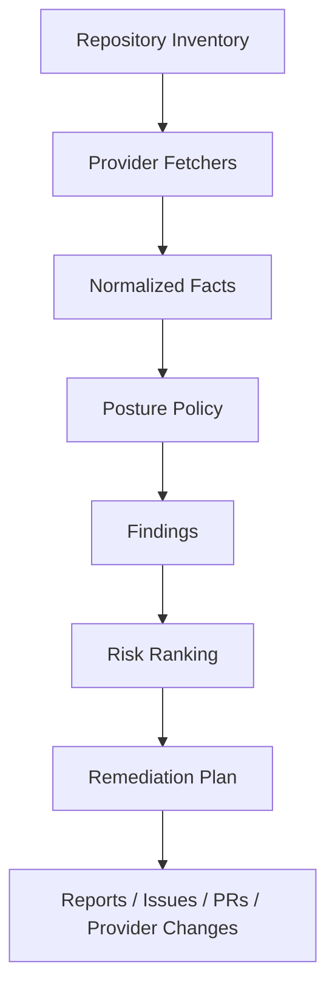

# Repository and CI/CD Posture

Repora treats repository security posture and CI/CD posture as declarative repository state, not as a standalone scanner.

The goal is to collect normalized facts about repositories, evaluate them against explicit posture policies, and eventually produce reviewable remediation plans.

## Implementation status

The posture architecture is intentionally layered. Current implementation covers fact collection only:

- `repoctl posture inventory OWNER/REPO` emits `repora.posture-inventory` v1 for GitHub repository/CI facts;
- `repoctl posture docs OWNER/REPO` emits `repora.posture-documentation` v1 for deterministic documentation/README facts;
- both collectors preserve observed/unknown/unavailable evidence and use a structurally GET-only GitHub provider boundary;
- documentation observation targets may be declared in `.repora/posture-documentation.yaml`, but that profile is fact-selection configuration rather than severity/remediation policy.

Mirror, hook/local-workflow, and commit/process fact domains remain next. Policy evaluation, findings, Markdown reports, issue/PR remediation, provider mutation, and non-GitHub provider adapters are not implemented yet.

## Goals

Posture work should make Repora useful for recurring repository stewardship, not only one-time bootstrapping.

Primary goals:

- **Harden repository security** by evaluating branch protection, ownership, access boundaries, secrets posture, dependency automation, release hygiene, and CI/CD trust boundaries.
- **Manage mirrors** by keeping canonical repositories, mirrors, remotes, provider metadata, and synchronization expectations explicit and drift-aware.
- **Maintain documentation and README hygiene** by checking for required docs, stale or missing sections, inconsistent project metadata, and repository-specific documentation expectations.
- **Analyze commit history** by surfacing risky change patterns, large or unusual commits, unsigned or unreviewed changes, release-boundary changes, and drift between declared process and observed history.
- **Govern hooks and local workflow controls** by tracking expected Git hooks, pre-commit checks, local policy entrypoints, and repo-specific developer workflow safeguards.

These goals should be expressed as facts, policies, findings, and remediation plans so they remain auditable and provider-neutral where possible.

## Purpose

Repository posture covers the durable controls around a repository: branch protection, ownership, security metadata, dependency automation, access boundaries, and release hygiene.

CI/CD posture covers the executable control plane around a repository: workflow permissions, runner trust, secret exposure, deployment gates, artifact handling, and supply-chain hardening.

Repora's role is to orchestrate posture management across repositories and providers.

## Non-goals

Repora should not become a replacement for specialized scanners.

It should delegate scan execution and vulnerability databases to tools such as:

- Gitleaks or equivalent secret scanners
- Semgrep or equivalent SAST engines
- OSV-Scanner or equivalent dependency advisory tools
- Trivy or equivalent container and SBOM scanners
- OpenSSF Scorecard or equivalent supply-chain posture tools
- Sigstore or equivalent artifact signing and provenance tools

Later posture layers may normalize scanner outputs into repository facts/findings, but current posture collectors do not execute scanners.

## Mental model



The important boundary is between fact collection and policy evaluation.

Facts describe observed state. Policies decide whether that state is acceptable.

## Repository posture

Initial repository posture facts include or may later include:

- default branch name
- branch protection state
- required status checks
- review and approval requirements
- force-push and deletion protection
- CODEOWNERS presence and coverage
- `SECURITY.md` presence
- license presence
- issue and pull request template presence
- dependency update automation presence
- secret scanning support and enablement where provider APIs expose it
- deploy key and collaborator posture where provider APIs expose it

The current GitHub inventory implements the default-branch/protection and file-backed metadata subset. Provider administration/access and scanner-specific facts remain future work.

Example finding categories for a future policy layer:

| Severity | Examples |
| --- | --- |
| High | default branch unprotected; force pushes allowed; broad write access |
| Medium | missing CODEOWNERS; dependency automation absent; release artifacts unsigned |
| Low | missing PR template; incomplete repo metadata |

## CI/CD posture

Initial CI/CD posture facts include or may later include:

- workflow files and CI provider configuration paths
- default workflow token permissions
- job-level permissions
- third-party action references and pinning style
- use of `pull_request_target`
- self-hosted runner labels
- deployment environment protections
- secret and variable scopes where provider APIs expose them
- artifact retention settings
- cache key patterns
- release and publishing workflows

The current GitHub inventory observes workflow/job declared permissions, `pull_request_target`, runner labels including literal `self-hosted` label evidence, and action/reusable-workflow pinning. It does not infer actual runner infrastructure from arbitrary labels or groups.

Important risk patterns for a future policy layer include:

- untrusted pull requests reaching privileged workflow contexts
- mutable third-party CI dependencies
- default write permissions for workflow tokens
- secrets exposed to forked or external contributions
- self-hosted runners reachable from untrusted code
- deployment jobs without explicit environment approval
- release workflows that publish unsigned or unaudited artifacts

## Mirror management posture

Mirror management should be part of posture because mirrors can silently become security, availability, and provenance risks.

Initial mirror facts should include:

- canonical repository identity
- declared mirror repositories
- configured remotes
- default branches across canonical and mirror repositories
- synchronization direction and mode
- drift between canonical and mirrors
- provider visibility and access settings
- release and tag propagation expectations

Important risk patterns:

- mirror accepts writes when it should be read-only
- mirror default branch diverges from canonical
- tags or releases exist in one provider but not another
- stale mirror presents outdated security fixes as current
- mirror metadata implies a different source of truth than `repora.yaml`

This domain is planned under issue #120 and must reuse Repora's existing `provider:path` topology and mirror semantics rather than inventing a second scanner.

## Documentation and README hygiene

Documentation hygiene is evaluated as repository state, not as prose preference.

The implemented documentation posture v1 can observe:

- repository-profile-selected document presence;
- README presence and configured ATX heading sections;
- configured repository-relative README links;
- deterministic exact content markers for bounded stale-metadata signals;
- document-router metadata presence and validity;
- canonical, implementation, generated, experimental, archived, external, or unclassified trust tiers for selected documents.

A repository may select these facts through `.repora/posture-documentation.yaml`. That repository-owned profile does not assign severity or make policy decisions. Missing facts are observed `false` only when evidence is complete; truncated or inaccessible evidence stays unknown/unavailable.

The collector preserves routing authority rather than treating all Markdown equally. Generated or archived documents are not silently promoted to canonical. This is particularly important for AI-assisted workflows that need deterministic source authority.

Important risk patterns for a future policy layer include:

- README describes obsolete commands or unsupported workflows
- security contact or disclosure process is missing
- docs disagree with configured CI/CD or release process
- archived/generated docs are treated as canonical
- repository purpose is unclear enough to cause unsafe automation

Full prose linting, semantic review, metadata inference, and LLM-based documentation judgment remain non-goals for the current fact collector.

## Commit analysis posture

Commit analysis should provide evidence about how repository changes actually happen over time.

Initial commit facts should include:

- signed commit and tag prevalence
- merge strategy patterns
- commit size and file-scope outliers
- sensitive-path changes
- release-boundary changes
- unreviewed or direct-to-main changes where provider APIs expose them
- author and committer patterns only where needed to establish process facts
- relationship between commits, issues, PRs, and releases

Important risk patterns:

- direct commits to protected or sensitive branches
- large mixed-purpose commits that obscure review
- unsigned release tags
- sensitive files changed outside expected review paths
- repeated hotfixes bypassing declared process

Commit analysis should focus on repository and process risk. It should not become individual productivity scoring, identity profiling, or intent inference. Findings should be grounded in observable repository evidence and phrased as review or governance signals.

## Hooks and local workflow posture

Hooks and local workflow controls should be tracked where repositories rely on them for safety or consistency.

Initial hook facts should include:

- expected hook manager, such as pre-commit, Lefthook, Husky, or custom Git hooks
- configured hook entrypoints
- required local checks
- relationship between local hooks and CI checks
- bootstrap instructions for developer machines
- bypass or escape hatch documentation

Important risk patterns:

- local hooks are required by convention but not documented
- CI does not enforce checks that local hooks are expected to catch
- hook bootstrap is missing or stale
- hooks execute unreviewed or network-loaded code
- repo-specific policy entrypoints are inconsistent across mirrors

## Normalized facts

Posture implementation should prefer provider-neutral facts over provider-specific checks.

The current versioned fact envelopes use explicit evidence state instead of collapsing missing access into `false`:

```json
{
  "state": "observed",
  "value": true,
  "evidence": [
    {
      "source": "github.git_tree",
      "reference": "owner/repo:<tree-sha>"
    }
  ]
}
```

Provider-specific data can remain available as evidence, but future policies should consume normalized facts where possible.

## Policy evaluation

Policies should be explicit, versioned, and explainable. This layer is not implemented yet.

Illustrative future shape:

```yaml
posture:
  profiles:
    baseline:
      repository:
        default_branch_protection: required
        required_reviews: 1
        security_md: recommended
      ci:
        default_token_permissions: read
        pin_third_party_actions: required
        pull_request_target: warn
        self_hosted_runners_on_public_prs: deny
```

A future finding should explain:

- observed fact
- expected policy
- severity
- provider evidence
- remediation options
- whether automated remediation is safe

Repository-owned documentation observation profiles are deliberately separate from this policy layer.

## Exceptions

Exceptions should be first-class once policy evaluation exists.

Illustrative future shape:

```yaml
posture:
  repos:
    repo.example:
      profile: baseline
      exceptions:
        - rule: ci.pin_third_party_actions
          reason: Internal workflow under active migration
          owner: platform
          expires: 2026-09-01
```

Exceptions should require a reason, owner, and expiry. Expired exceptions should become findings.

## Remediation plans

Posture remediation should separate observation, planning, and mutation. These commands are future design, not current CLI behavior:

```bash
repoctl posture check
repoctl posture plan
repoctl posture apply
```

`check` must be read-only.

A future `plan` may propose explicit changes, such as:

- update workflow permissions
- add missing `SECURITY.md`
- create or update CODEOWNERS
- open issues for provider settings that require manual confirmation
- propose branch protection updates
- update README or documentation sections
- reconcile mirror metadata or remote configuration
- flag risky commit history patterns for review
- add or standardize hook configuration

Any future `apply` must only run after review and preserve the diff-first execution model used elsewhere in Repora.

## CLI surface

Current posture commands are:

```bash
repoctl posture inventory OWNER/REPO
repoctl posture docs OWNER/REPO
```

Candidate future commands include:

```bash
repoctl posture check
repoctl posture diff
repoctl posture plan
repoctl posture report --format markdown
repoctl posture issue create --repo repo.example
```

Focused helpers may be useful later:

```bash
repoctl mirrors check
repoctl commits analyze
repoctl hooks check
```

These should remain posture-oriented commands rather than becoming a general CI runner, documentation linter, or commit-forensics tool.

## Provider support

Provider support should be incremental.

| Provider | Current/planned support |
| --- | --- |
| GitHub | Current repository/CI and documentation fact collection; broader provider-admin facts planned |
| GitLab | Planned protected branches, CI configuration, approval rules, repository metadata |
| Bitbucket | Planned branch restrictions, pipelines configuration, repository metadata |
| Local repositories | Planned file/config/lockfile/hook and scanner-output facts where appropriate |

GitHub is the first implementation target because it exposes enough API surface to validate the model end-to-end.

## Security model

Posture management is security-sensitive because later layers may propose changes to repository controls.

Current and future implementation must preserve these boundaries:

- read-only fact collection by default;
- no implicit provider mutations;
- explicit plans before writes;
- least-privilege provider tokens;
- no secrets stored in `repora.yaml` or posture evidence;
- provider evidence retained for audit;
- repository-owned observation profiles cannot grant policy or mutation authority;
- clear distinction between file PRs and direct provider API mutations.

Provider API mutation should come only after deterministic facts, policy/reporting, and reviewable file-based remediation are proven.

## Implementation phases

Current ordered path:

1. **Complete** — read-only GitHub repository/CI inventory and normalized fact/evidence contract (#118).
2. **Complete** — deterministic documentation/README hygiene facts and observation profile (#119).
3. **Next** — mirror-management drift facts reusing existing topology/status semantics (#120).
4. **Planned** — hooks/local-workflow facts without executing hook code (#123).
5. **Planned** — bounded commit/process-risk facts without productivity scoring or intent inference (#122).
6. **Convergence** — explicit policy evaluation and deterministic Markdown reporting over normalized facts (#121).
7. **Later** — issue/PR-backed remediation after reporting is proven.
8. **Later/separate decision** — guarded provider API mutation.
9. **Later** — GitLab and Bitbucket adapters.

The active implementation order is maintained in [`plans/current.md`](plans/current.md) and GitHub issue #124.
