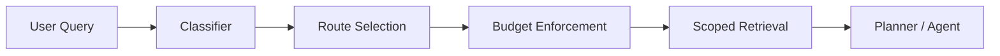

# Document Routing

## Purpose

Repora needs deterministic context selection.

Without routing:

* agents load excessive context
* token usage scales with repository size
* prompts become unstable
* retrieval becomes noisy
* unrelated specifications contaminate planning

The document router constrains context selection before retrieval expansion.

---

## Mental Model

The router behaves more like a query planner than semantic search.



The critical idea:

> Determine likely scope before reading large volumes of content.

This prevents broad repository ingestion.

---

## Design Goals

### Deterministic

The same query should produce approximately the same retrieval set.

### Bounded

Every route has:

* file limits
* byte limits
* token budgets
* truncation behavior

### Explainable

A route should be inspectable and reviewable.

### Composable

Routing rules should layer:

* architecture
* policy
* prompts
* operations
* schema

### Provider-agnostic

The router should work with:

* Codex
* Claude Code
* Cursor
* OpenAI APIs
* local RAG systems
* Anthesis-style orchestration

---

## Routing Strategy

Repora uses:

* keyword classification
* path weighting
* deterministic pruning
* explicit budgets

It intentionally does NOT require:

* embeddings
* vector databases
* semantic chunk stores

Those can exist later as optional augmentations.

---

## Recommended Directory Strategy

The router works best when repositories separate concerns.

Recommended structure:

```text
/docs
  /architecture
  /adr
  /policy
  /req
  /routing
  /spec
/prompts
/schemas
/examples
/src
/tests
```

Avoid:

* massive monolithic RFCs
* duplicated summaries everywhere
* embedding implementation details in overview docs
* storing prompts beside unrelated implementation code

---

## Token Reduction Techniques

### 1. Route before retrieval

Do not recursively scan the repository first.

### 2. Prefer canonical sources

One canonical architectural document is better than many partial summaries.

### 3. Exclude low-signal directories

Examples:

* tests
* generated assets
* vendor
* build artifacts
* archives

### 4. Truncate structurally

Prefer:

* headings
* summaries
* interface sections

before full body inclusion.

### 5. Separate prompts from specifications

Prompt overlays should not require loading all architectural documentation.

---

## Failure Modes

### Context contamination

Unrelated RFCs affect planning.

### Retrieval drift

Agents select different files each run.

### Token exhaustion

Large repos exceed provider limits.

### Hidden policy conflicts

Old docs override current design unintentionally.

### Recursive prompt loading

Prompts reference prompts reference prompts.

---

## Security Considerations

Routing is part of the trust boundary.

Potential risks:

* malicious prompt injection in unrelated docs
* archived RFCs influencing current planning
* hidden instructions in examples
* context poisoning through generated files

Mitigations:

* route allowlists
* path scoping
* canonical sources
* archived document exclusion
* deterministic ordering
* explicit prompt boundaries

---

## Long-Term Direction

Potential future enhancements:

* graph-aware routing
* spec dependency analysis
* AST-aware source routing
* semantic augmentation
* trust scoring
* signed document classes
* policy-enforced context boundaries

The key constraint:

> semantic retrieval must remain subordinate to deterministic routing.
